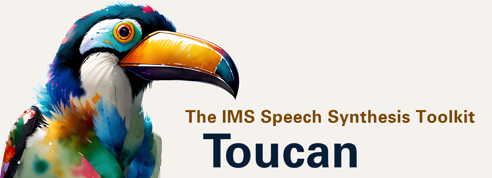

Voici un clone du projet [IMS Toucan Version 2.4 (Fevrier 2023)](https://github.com/DigitalPhonetics/IMS-Toucan/tree/v2.4) qui comprend quelques modifications pour améliorer la prononciation en français. 

L'objectif de ce dépôt est de fournir un outil de clonage de voix qui fonctionne mieux en français. 

# Installation

L'installation peut sembler fastidieuse sur le site original. Pourtant il suffit de suivre pas-à-pas les indications données. Je les reprends ici en y apportant quelques explications si besoin.

## Optionnel : Création d'une "console virtuelle" Screen
Ma machine dédiée à l'Intelligence Artificielle (IA) est dans une pièce séparée et ne dispose ni d'écran ni de clavier. Elle est connectée au réseau local et j'y accède donc depuis mon ordinateur portable via `ssh`. Le problème est que dès que je me déconnecte (par exemple en éteignant mon ordinateur), la session ssh se ferme et tout ce qui était en train de tourner s'arrête aussi. C'est donc bien ennuyeux, car les installations ou les entrainements de modèle durent longtemps et que c'est dommage de devoir laisser mon ordinateur de travail allumé à ne rien faire.

C'est pourquoi j'ai installé (sur la machine IA distante) le programme "screen" (`apt install screen` sur Debian/Ubuntu). Comme ça, même quand je me déconnecte, les processus lancés dans la console virtuelle perdurent, et je peux ensuite restaurer cette console virtuelle à ma guise, lorsque je me reconnecte à distance.

Donc avant de commencer, je créé une nouvelle console virtuelle que je nomme Toucan pour me souvenir de ce qu'elle fait : `screen -S Toucan`.

Ensuite, je fais ce que j'ai à faire dans cette console, je peux lancer des processus longs, et éteindre mon ordinateur portable de travail pour l'économiser. Quand je reviens, et que je veux reprendre où j'en étais, je fais simplement un `screen -r Toucan`.

> Une fois la console réactivée, je peux voir l'historique de la sortie d'écran en utilisant les touches : "ctrl-a" puis "échap". La molette de la souris fonctionne et me permet de voir ce qui s'est affiché à l'écran en mon absence (en fait il n'y a pas tout jusqu'au début). Ensuite je rappuie sur "échap" pour revenir à l'affichage courant.

> ATTENTION : surtout ne laissez jamais la console virtuelle screen en mode historique (cf juste ci-dessus). Sinon au bout d'un moment, le processus en cours se fige, probablement parce que le tampon mémoire de screen est plein. Donc pensez bien à sortir de ce mode historique en appuyant sur "échap" avant de fermer la session. Si vous oubliez, vous verrez la prochaine fois que vous restaurerez votre console virtuelle que l'entrainement n'a pas avancé, les processus étant comme en pause (mémoire GPU remplie normalement, mais activité GPU à 0).

## Création et activation d'un environnement virtuel python
On va tout d'abord créer un environnement virtuel python qui permettra d'avoir un environnement python dédié à Toucan, sans avoir à gérer les conflits avec les autres paquets déjà installés et utilisés par les autres projets python.

On utilise la commande python suivante :
`python3 -m venv toucanenv`

J'ai choisi comme nom de cet environnement python "toucan(env" mais vous pouvez choisir ce que vous voulez. L'essentiel c'est que ça vous parle.

Et on active cet environnement :
`source toucanenv/bin/activate`

> Si jamais vous avez besoin de sortir de cet environnement python dédié, tapez la commande suivante : `deactivate` . Notez bien qu'elle est accessible directement, sans aller dans le répertoire toucanenv.

## Installation de Toucan
Maintenant vous pouvez passer à l'installation de Toucan proprement dite. 

On clone tout d'abord le projet en local :

On se rend dans le répertoire créé :
`cd IMS_Toucan_V24_French`

Puis on lance l'installation :
`pip install -r requirements.txt`

> L'auteur de Toucan utilise la commande d'installation avec l'option "no-cache-dir" qui oblige à tout retélécharger depuis les serveurs sources. Je conseille plutôt d'utiliser le cache python contenant les bibliothèques déjà téléchargées, car ça rend le processus d'installation bien plus rapide et moins gourmand en bande passante.

L'installation peut prendre un certain temps, en fonction des bibliothèques qu'il faut télécharger.

## Installation de espeak-ng
Espeak-ng est un phonémiseur (transforme le texte en entrée en phonèmes) qui est appelé en interne par Toucan. On l'installe simplement par la commande :
`apt install espeak-ng`

# Entrainement
Le but de l'entrainement est d'arriver à imiter la voix du personnage qu'on souhaite, grâce à des extraits des sa voix accompagnés de leurs retranscriptions.

À SUIVRE...

